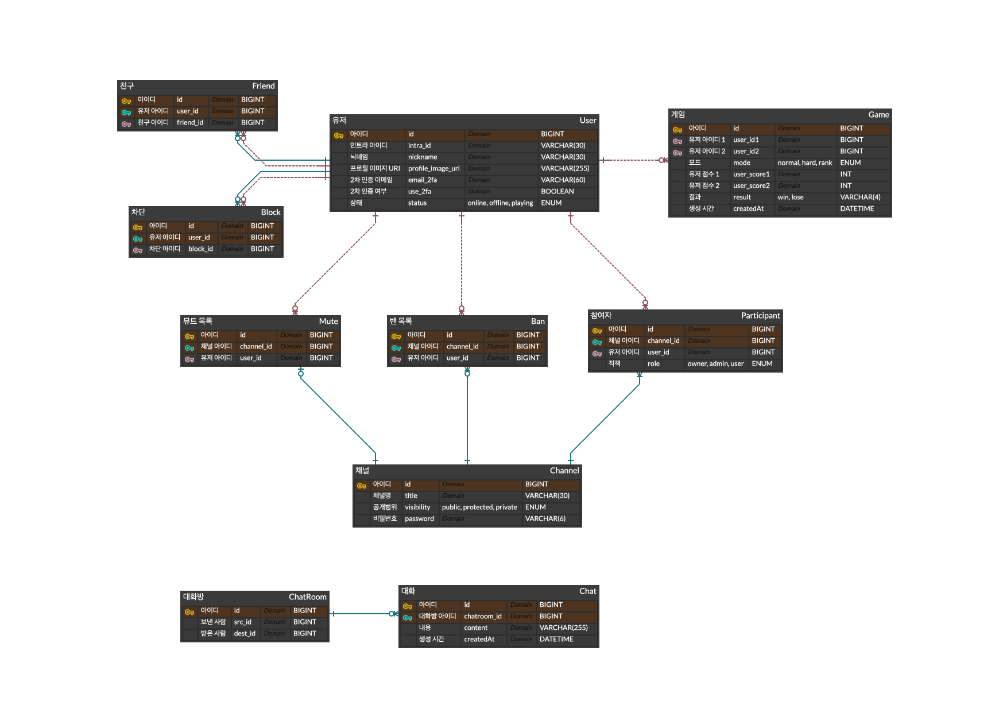
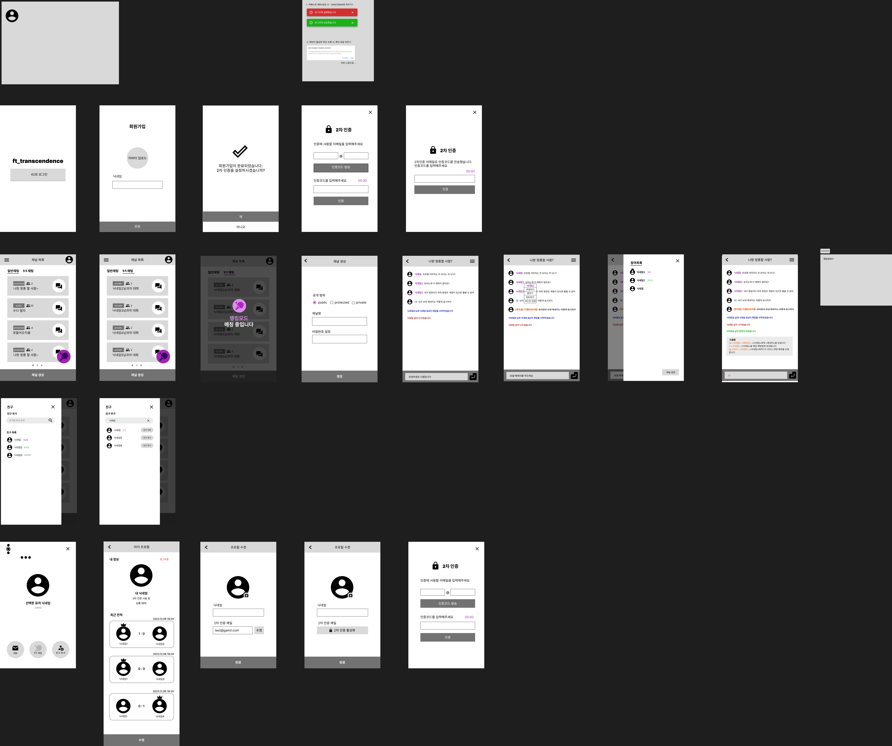

## 목차

- [프로젝트 소개](#프로젝트-소개)
- [사용 기술](#사용-기술)
- [기여한 부분](#기여한-부분)
- [구현 기능](#구현-기능)
  - [사용자 계정](#사용자-계정)
  - [채팅](#채팅)
  - [게임](#게임)
  - [보안 고려 사항](#보안-고려-사항)
- [설치 및 설정](#설치-및-설정)
- [ERD](#erd)
- [API](#api)
- [디자인](#디자인)

## 프로젝트 소개

"pong-game"은 고전 pong 게임을 웹 브라우저를 통해 로컬 환경에서 동작하도록 만든 프로젝트입니다.

## 사용 기술

- 백엔드: NestJS
- 프론트엔드: NextJS
- 데이터베이스: PostgreSQL
- 배포: Docker Compose
- 기타: SocketIO, Swagger

## 기여한 부분

- REST, Socket API 설계, 개발
  - 채널, 채널 관리자 권한
  - 채팅 관련 기능
- DB 설계

## 구현 기능

### 사용자 계정

- OAuth를 통한 로그인.
- 보안 강화를 위한 2FA.
- 사용자 닉네임과 프로필 이미지 설정.
- 친구 시스템 및 실시간 사용자 상태 업데이트.
- 게임 히스토리 시스템.

### 채팅

- 공개 및 비공개 채팅 채널, 선택적 비밀번호 보호 기능.
- 개인적인 소통을 위한 다이렉트 메시지 기능.
- 개인 채팅 경험 관리를 위한 사용자 차단 기능.
- 채널 소유자와 관리자의 관리 권한(음소거, 강제퇴장, 영구퇴장).
- 채팅을 통한 사용자 초대 및 프로필 확인 기능.

### 게임

- 웹사이트에서 직접 플레이 가능한 실시간 1:1 게임.
- 플레이어 매칭을 위한 매칭 시스템.
- 다양한 장치와 화면 크기에 맞는 반응형 디자인.
- 네트워크 상태에 대한 예외 처리.

### 보안 고려 사항

- 안전한 저장을 위한 비밀번호 해싱.
- SQL injection에 대한 보호.
- 모든 사용자 입력 및 폼에 대한 서버 측 유효성 검사로 취약점 방지.

## 설치 및 설정

저장소를 클론하고 프로젝트 디렉토리로 이동합니다:

```sh
git clone [저장소-링크]
cd pong-game
```

`src/service/*/.env.sample`을 참고하여 `.env`파일 작성

Docker Compose를 사용하여 애플리케이션 실행:

```sh
docker-compose up --build
```

`/etc/hosts` 에 도메인 추가

브라우저에서 `http://localhost:[포트]` 또는 추가한 도메인으로 접속

## ERD



## API

[pong-game-API-Document](./doc/pong-game_API_document.pdf)

## 디자인


